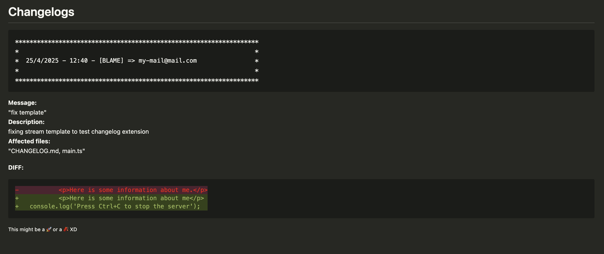
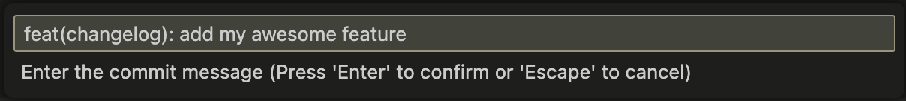
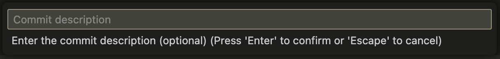

# Auto CHANGELOG for VS Code

Auto CHANGELOG is an extension for Visual Studio Code that automates the generation and updating of your project's `CHANGELOG.md` file based on Git commit messages.

    

## Features

- **Automatic changelog generation:**
  - When you make a commit using the extension command, a new entry is added to `CHANGELOG.md` with the commit information, optional description, affected files, and the diff of the changes.
- **Interactive prompt:**
  - Prompts for the commit message and an optional description directly in the VS Code interface.
- **Detailed logging:**
  - Each changelog entry includes date, author, message, description, changed files, and the commit diff.
- **Automatic organization:**
  - The changelog is updated so that the most recent entry always appears at the top of the file.

## How to use

1. Open the `Commit and Generate CHANGELOG.MD` command from the command palette (`Ctrl+Shift+P` or `Cmd+Shift+P`).
2. Enter the commit message when prompted.
3. (Optional) Enter a detailed description of the changes.
4. The extension will:
   - Add and commit all changes in the Git repository.
   - Generate/update the `CHANGELOG.md` file at the root of the project with the commit information.
   - Make an additional commit to record the changelog update.

## Requirements

- Project must be versioned with Git.
- Node.js installed.

## Available Command

- `auto-changelog.commit`: Commits and automatically generates/updates the `CHANGELOG.md`.

#### For example:

    
    

## Notes

- The `CHANGELOG.md` file is created automatically if it does not exist.
- The displayed diff corresponds only to the changes of the performed commit.

## Contribution

Feel free to open issues or pull requests to suggest improvements or report problems.

## About me

I'm a frontend engineer that codes stuff for fun. You can find me here: https://github.com/DioLps

## Release Notes

### 0.0.1

Initial release of Auto CHANGELOG (auto-changelog)

---

**Enjoy!**